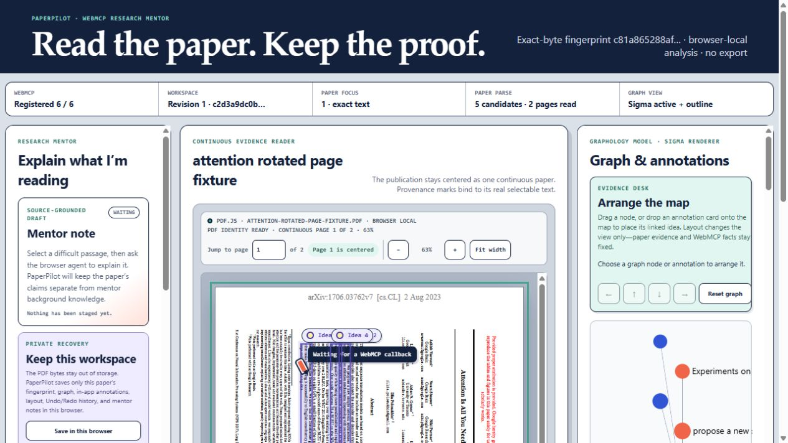
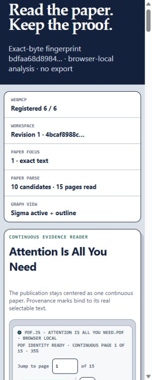

# Centered continuous Reader acceptance — 2026-08-31

This record closes guided-build checklist item 3 for the public `/webmcp/` bundle. It covers the Reader surface only. Automatic semantic-candidate quality, arbitrary figure-region authoring, authenticated persistence, and cross-paper synthesis remain later gates.

## Result

The packaged Pages artifact renders the paper as the dominant center surface, keeps the research mentor on the left and Graph/Evidence on the right at desktop width, and reflows to paper → mentor → graph at narrow widths. The workspace DOM uses that same paper-first order. No persistent transcript element or transcript layout region exists.

The Reader uses stable continuous page shells with a bounded canvas/text render window, page-owned selectable PDF.js text, rotation-aware source geometry, active-page tracking, a page locator that scrolls, direct source return, zoom controls, and browser-local loading/error states.

## Cross-PDF matrix

| Paper | Source | SHA-256 | Pages | Text-indexed pages | PDF rotation | Result |
| --- | --- | --- | ---: | ---: | --- | --- |
| *Attention Is All You Need* v7 | `https://arxiv.org/pdf/1706.03762v7` | `bdfaa68d8984f0dc02beaca527b76f207d99b666d31d1da728ee0728182df697` | 15 | 15/15 | 0° on all pages | Continuous Reader, render window, text index, analysis, and source navigation passed. |
| *Observation of Gravitational Waves from a Binary Black Hole Merger* | `https://arxiv.org/pdf/1602.03837` | `e5e864c23d015b69be17e5b5d51b5b462d2829353a867513414b6728f54589c4` | 16 | 16/16 | 0° on all pages | Two-column Reader, render window, text index, and analysis completed without empty pages. |

The unrelated-paper run intentionally stayed outside the repository. It exposed weak heuristic candidate labels in the automatic semantic map; those remain explicitly `system_derived_candidate` and `unreviewed`. That quality issue is a gate for checklist item 5, not evidence against the PDF Reader.

Rotation was exercised separately with a temporary two-page PDF whose first page carried real `/Rotate 90` metadata. The file was derived for QA from the exact Attention fixture and was not committed or packaged. PDF.js rendered the rotated first page at 502 × 387.9 CSS pixels; its canvas matched 502 × 387.9, its text layer matched 502 × 387, all 69 text spans stayed within the page, and the same alignment held at 78% PDF zoom.

## Live browser checks

- At 1280 × 720 CSS pixels, the mentor occupied x=8…278, the centered paper x=292…923, and Graph/Evidence x=937…1257. The annotation composer measured 561 client / 561 scroll pixels and its submit button remained inside the paper stage.
- Fit width now subtracts the scrollport's complete computed inline padding. The desktop PDF viewport measured 546 client / 546 scroll pixels instead of producing the earlier 20-pixel horizontal pan.
- Natural wheel input inside the rotated continuous Reader moved its internal scroll position from 0 to 388 and changed the active page plus page input from 1 to 2. `Go to current source` returned to scroll position 0, page 1, and the exact issued anchor.
- At 63%, 78%, and restored 63% PDF zoom, canvas and text-layer bounds remained aligned; no text span escaped the rotated page.
- The 200% reflow condition was exercised as the equivalent 640-CSS-pixel layout on a 1280-pixel host because the in-app browser does not expose browser-chrome zoom. It produced no document overflow, put paper first, collapsed the annotation composer to one column, and contained the PDF viewport. The stricter final mobile run below also covers a smaller usable CSS width.
- With the browser viewport set to 320 CSS pixels, the vertical scrollbar left 305 usable CSS pixels. `documentElement.clientWidth`, document scroll width, and body scroll width all measured 305; there was no document-level horizontal pan. The PDF viewport measured 236 client / 236 scroll pixels, fit the first page at 216 pixels and 35%, kept all 15 page shells, and clipped zero controls.
- The semantic browser snapshot exposed a labeled PDF region; labeled page input; zoom and fit controls; page regions with selectable paper text; source anchors; a labeled annotation form; a complementary mentor region; and an accessible graph outline. Canvas and paint overlays remain hidden from accessibility APIs. Reduced-motion, forced-colors, and two-surface focus-ring rules are present.
- Browser warnings and errors were absent during the packaged-artifact runs. No PDF bytes, local database, remote database, export, service worker, or external persistence path was added.

## Screenshots

## Automated verification

- `pdf-viewer.test.mjs`: 23/23 passing, including 0°/90°/180°/270° source geometry, RTL clipping, active-page selection, locator math, render-window bounds, and computed-padding fit width.
- Focused viewer plus paper-analysis cross-PDF matrix: 37/37 passing.
- Strict WebMCP `checkJs`: passing.
- Full repository, bundle, and release gates are recorded in the build journal checkpoint that references this evidence.

## Residual manual check

A literal browser-chrome 200% zoom run with a human screen reader remains a useful final accessibility walkthrough. The in-app test surface cannot toggle browser chrome zoom, so this record makes the equivalence explicit rather than claiming a control it did not exercise. The 640-CSS-pixel equivalent and stricter 305-usable-CSS-pixel run found no implementation blocker.
