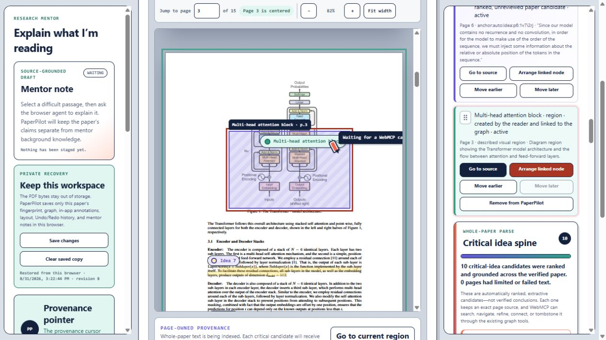
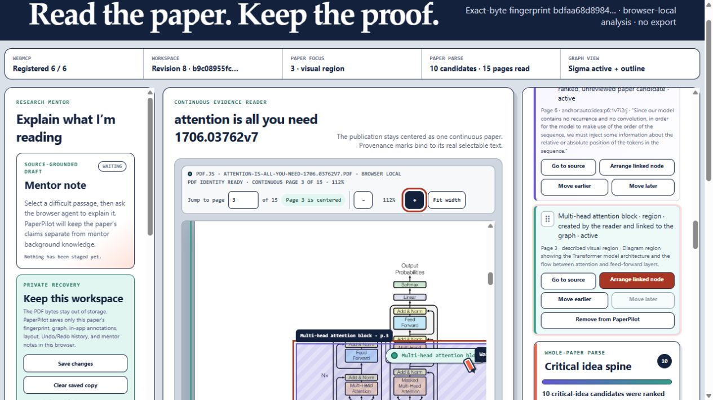

# Spatial anchor and annotation acceptance — 2026-08-31

This record closes the implementation and automated verification work for guided-build checklist item 4. Verification Pause 2 remains intentional: the owner must inspect centered reading, region selection, and exact source return in the deployed build before checklist item 5 begins.

## Result

PaperPilot now supports document-bound exact-text and visual-region anchors in the real continuous PDF Reader. A reader can start a page-owned region lens, draw it with a pointer or adjust it with the keyboard, add a required nonvisual description, turn it into an in-app annotation plus reader-authored graph node, return from the graph/list to the same PDF region, and remove the PaperPilot records through a guarded soft-delete flow. Human Undo and Redo rehydrate or remove both the semantic records and the visible overlay. The original PDF bytes are never edited or exported.

Canonical anchors are independent of browser layout. They retain the exact PDF SHA-256, paper reference, document revision, zero-based page index, page label, CropBox view box, rotation, normalized top-left geometry, derived PDF-space geometry, PDF.js renderer recipe and digest, authority, source/geometry kind, optional exact quote context and text-item references, rendered-region digest, and complete anchor digest. Point, rectangle, and quadrilateral transforms support 0°, 90°, 180°, and 270° pages. Validation fails closed for foreign documents, stale renderer recipes, malformed or out-of-page geometry, normalized/PDF disagreement, quote/hash disagreement, and digest tampering.

## Live browser walkthrough

The packaged `/webmcp/` artifact was served through the same constrained Pages path used by CI.

On *Attention Is All You Need* v7, the reader opened page 3 and started a visual-region lens. The draft exposed:

- the accessible name `Draft PDF region on page 3`;
- the description “Use arrow keys to move this region. Hold Shift with an arrow key to resize it. Press Enter to keep the region or Escape to cancel.”;
- arrow-key movement, Shift+Arrow resize, Enter confirmation, and Escape cancellation;
- an announced page, left/top position, width, height, and input method after every adjustment.

The browser walkthrough moved and resized the draft to normalized bounds `{ x: 0.265, y: 0.255, width: 0.515, height: 0.255 }`, supplied the required description, and created:

- annotation label: `Multi-head attention block`;
- annotation kind: `region`;
- graph node kind: `figure`;
- authority: `reader_authored`;
- exact source: page 3 of the active PDF;
- nonvisual description: “Diagram region showing the Transformer model architecture and the flow between attention and feed-forward layers.”

The final persisted target is programmatically focusable, named `Multi-head attention block, visual region on page 3`, and carries the longer visual description separately. `Go to source` focused that semantic PDF target and changed the primary source action to `Go to current region`.

At 82% and 112% PDF zoom, its normalized style remained byte-identical:

```text
left: 26.5%; top: 25.5%; width: 51.5%; height: 25.5%
```

Human Undo removed the annotation, linked reader node/edge, and overlay while retaining the page-owned anchor in reversible history. Human Redo restored the semantic records and overlay. `Remove from PaperPilot` required a second activation (`Confirm remove`), clearly stated that the PDF would not change, soft-tombstoned the in-app records, and remained reversible with Human Undo. The final controls announce whether Undo restored the previous state or Redo reapplied it.

After `Save in this browser`, a hard reload plus selection of the exact same PDF restored revision 8, the annotation card, graph node, source anchor, and overlay. Snapshot restoration validates every canonical spatial anchor before mutating live state. Rehashed corruption of geometry, rotation, quote metadata, renderer recipe, embedded document digest, PDF-space geometry, region digest, or anchor digest is rejected atomically. Legacy unversioned fixture anchors remain readable without weakening canonical validation.

## WebMCP proof

The page registered all six tools. A real page-defined WebMCP call searched the active graph for `Multi-head attention block` and returned one `reader_authored` figure node whose only source was the newly minted page-3 spatial anchor. A subsequent `paperpilot.focus_source` call targeted that node and returned the same anchor and page. `paperpilot.read_focus` then exposed `sourceKind: visual_region`, the exact normalized bounds, `authority: client_rendered_pdf`, and a locator-only visible-region ID equal to the issued anchor ID.

The WebMCP boundary remains intentionally asymmetric:

- WebMCP can search and navigate issued reader nodes and anchors.
- WebMCP can use only page-minted anchors for annotation commands.
- Raw PDF coordinates, human Undo/Redo, reader-removal controls, Save/Discard, PDF mutation, hard delete, and export are not tools.
- Reader removal is a trusted page-owned transaction, not an agent-callable operation.

## Cross-PDF boundary matrix

| Paper | SHA-256 | Pages | Region result | Isolation result |
| --- | --- | ---: | --- | --- |
| *Attention Is All You Need* v7 | `bdfaa68d8984f0dc02beaca527b76f207d99b666d31d1da728ee0728182df697` | 15 | Page-3 described region became a reader-authored figure node and survived zoom, Undo/Redo, guarded removal, and exact-PDF reload. | Attention node returned from WebMCP search only in this paper. |
| *Observation of Gravitational Waves from a Binary Black Hole Merger* | `e5e864c23d015b69be17e5b5d51b5b462d2829353a867513414b6728f54589c4` | 16 | Page-1 described region became the reader-authored figure node `Binary black-hole strain signal`. | No Attention snapshot restored, the status remained active-tab-only, and WebMCP returned zero matches for `Multi-head attention block`. |

The unrelated PDF stayed in ignored temporary QA storage and is not part of the repository or public artifact.

## Accessibility and interaction audit

- Pointer geometry is clamped to the active page and rejects zero-area/out-of-page regions.
- The keyboard path supports movement, resize, fine adjustment, confirm, and cancel without requiring pointer input.
- A whole-page fallback is available for readers who cannot draw or reconcile a precise rectangle.
- Visual regions cannot be saved without a screen-reader description.
- The draft region is an interactive labeled `region`; persisted sources are labeled `note` targets that source buttons can focus programmatically.
- Annotation cards are keyboard focusable and announce source kind, status, page, source summary, and linked graph counts.
- The visible overlay label uses the concise reader label while `aria-description` retains the full nonvisual description.
- Exact-text marks use line-level rectangles rather than one misleading multi-line union outline; visual regions retain a bounded rectangular evidence lens.
- Decorative SVG paint is hidden from accessibility APIs; the separate semantic target remains available.
- Reduced-motion and forced-colors styles remain present. A literal human screen-reader walkthrough is part of Verification Pause 2 rather than silently claimed by automation.

## Screenshots





## Automated verification

- Root application tests: **701/701 passed**.
- WebMCP/module tests: **139/139 passed**. These cover canonical spatial geometry, all four rotations, point/rectangle/quad round trips, pointer clamping, keyboard manipulation, exact-text and region minting, document/renderer binding, focus navigation, trusted removal, Undo/Redo, overlay rehydration, snapshot validation, and atomic tamper rejection.
- Pages packaging: **1/1 passed**, including byte-reproducible rebuilds and rejection of PDF bytes, source maps, secrets, and credential-shaped content.
- Total automated assertions: **841 passed, 0 failed**.
- JavaScript syntax, repository ESLint, repository TypeScript, strict WebMCP `checkJs`, generated Pages build, optimized Next.js production build, and `git diff --check`: passed.
- Browser diagnostics during both live PDF runs: no warnings or errors.

## Deliberate boundary for Verification Pause 2

Implementation and automated gates are green. Before item 5 proceeds, the owner should use the deployed build to inspect three things directly:

1. the PDF remains the dominant centered reading surface;
2. `Mark a region` feels understandable with pointer and keyboard controls, including the required description;
3. the annotation card and graph/source controls return to the exact visible region without a transcript window.

No structural-map quality claim is added here. Honest whole-paper structural coverage remains checklist item 5.
